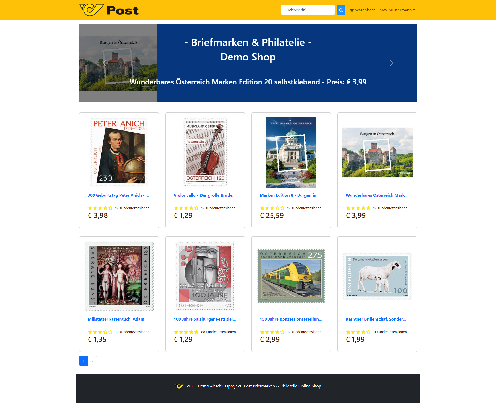

Project Examen for WIFI Wien: Ausbildung zum/zur geprüften Full Stack Javascript Developer  (Education for certified Full Stack Javascript Developer, Course 18190012)

### Project goals
About 100 development hours invested in all the project phases which includes:
- Project documentation
- Use of SCM github
- Own user interface
- Functional and object-oriented programming
- Client/Server communication, REST/CRUD
- Use of arrow functions, promises, template strings
- Event listener
- NodeJS server application (file system, routing, Proxy HTTP)
- Database and Data storage (MongoDB)
- Mongoose, an Object Data Modeling (ODM) library for MongoDB and Node.js
- User error handling
- Authentication, JWT
- Use of MVC patterns
- Single page application with ReactJS
- ReactJS Components
- Encryption
- Security
- Project hosting
- Product reviews and ratings

### Graduation project
Develop a fictitious online shop named „Post Stamps and philately“, build on the technology what was taught during the WIFI course on top of the latest MERN stack technology and Redux



#### The project main parts are:

- User profile with orders
- Admin product management
- Admin user management
- Admin Order details page
- Product search feature
- Top products carousel
- Product pagination
- Mark orders as delivered option
- Checkout process (shipping, payment method, etc)
- PayPal / credit card integration

#### How to use
##### Install Dependencies (frontend & backend)
```
npm install
cd frontend
npm install
```

##### Run
Rename env.example to .env
Run in development mode (:3000) & backend (:7000)

```
cd ../backend
npm run dev
```

##### Run backend only
```
npm run server
```

#### Build & Deploy

##### Create frontend prod build
```
cd frontend
npm run build
```
##### Sample User Logins
admin@gmail.com (Admin) 
Password: 123123

max@gmail.com (User)
Password: 123123
